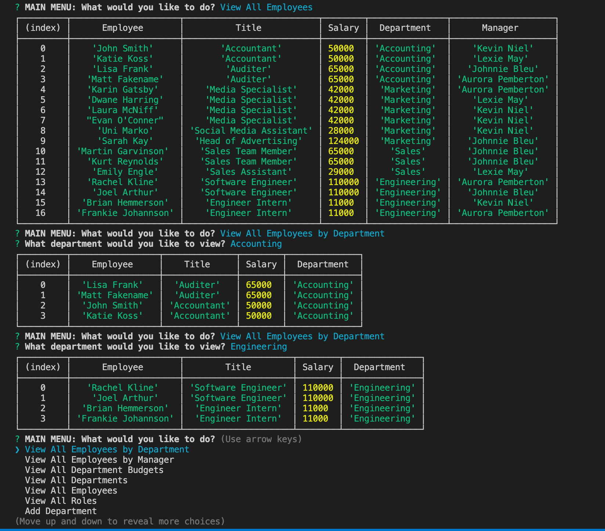

# EmployeeTracker

---

## Application Output Example

 ---
## Description

  *The what, why, and how:*

  In this assignment, we were tasked with creating a command-line application that allows the user to:
      * Add departments, roles, employees

  * View departments, roles, employees

  * Update employee roles

Bonus points if you're able to:

  * Update employee managers

  * View employees by manager

  * Delete departments, roles, and employees

  * View the total utilized budget of a department -- ie the combined salaries of all employees in that department

  I complete this task using mySQL, Inquirer, and the console.table in order to print rows to the console. I also used SQL JOINS in order to make this a functional application.

  ---

## Table of Contents

  - [Applicaton Output Example](#application-output-example)
  - [Description](#description)
  - [Usage & Installation](#usage-&-installation)
  - [Questions](#questions)
 
 ---

## Usage & Installation
  *Instructions and examples for use:*

Start by npm installing inquirer, mysql, and console.table.

Run this application by typing node index into the console log. You will then be prompted with a large list of options containing many things you can do. Feel free to build your departments, roles, and employees however you like! If you make a mistake, no worries! You are able to delete anything you add.
  
---

## Questions?

  *For any questions about this application, please contact me via the information below:*

  GitHub: https://github.com/users/rachelkline
  
  Email: rachel_kline@icloud.com

---
   

  [Icons provided by https://fontawesome.com/]